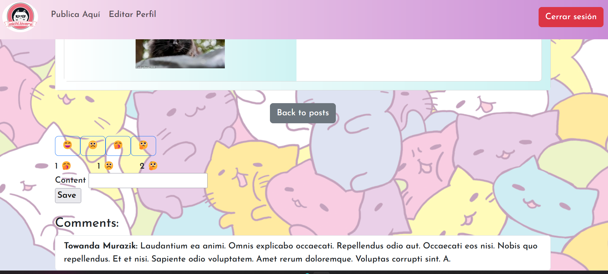
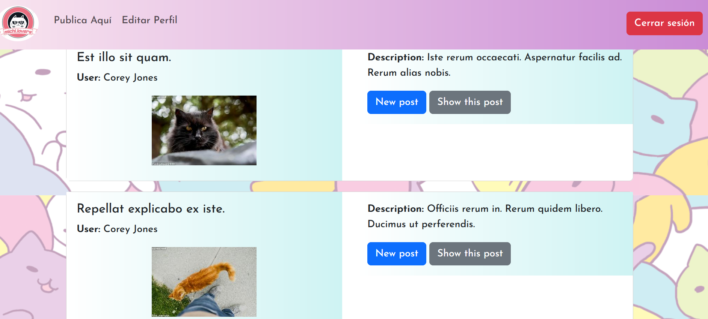

# Michi.Lovers 😻

Michi.Lovers es una aplicación web para Catlovers, con el fin de que muestren su amor por los gatos, los usuarios pueden Iniciar sesión,  ver distintos post o escribir uno, reaccionar y comentar. Realizado como actividad evaluada de Bootcamp Ruby on Rails para StartUp

## Visuales 🐈



---



## Empezando 🚀

Estas instrucciones te guiarán para obtener una copia de este proyecto en funcionamiento en tu máquina local para propósitos de desarrollo y pruebas.

Clona el repositorio desde GitHub

```bash
git clone https://github.com/Sandyluuu/Michi.Lovers
```

Accede al directorio del proyecto

```bash
cd Michi.Lovers
```

### Prerrequisitos 📋

Lista de software y herramientas, incluyendo versiones, que necesitas para instalar y ejecutar este proyecto:

- Sistema Operativo (Ubuntu 20.04, Windows 10 en adelante, Mac OS X 10.9 en adelante)
- Lenguaje de programación Ruby 3.2.2
- Framework Rails 7.0.6
- Base de datos PostgreSQL

### Instalación 🔧

Instala las gemas y dependencias

```bash
bundle install
```

Crea la base de datos y ejecuta las migraciones

```bash
rails db:create
rails db:migrate
```

Ejecuta el archivo seed para poblar la base de datos

```bash
rails db:seed
```

Ejecuta el servidor de desarrollo

```bash
rails server
```

<!-- # Ejecutando las Pruebas ⚙️ -->

<!-- Para ejecutar el conjunto de pruebas, utiliza el siguiente comando: bash: rspec -->

<!-- # Pruebas de Estilo de Código ⌨️ -->

<!-- Las pruebas de estilo de código garantizan que el código se ajuste a las guías de estilo y buenas prácticas establecidas. -->

## Uso

- Abre tu navegador y ve a la dirección `http://localhost:3000`.
- Serás dirigido a la Página Home, donde puedes registrarte o iniciar sesión
- Después de iniciar sesión, puedes revisar los distintos artículos o noticias.

## Despliegue 📦

Para desplegar el proyecto en un ambiente de producción, sigue los siguientes pasos:

1. Configura las variables de entorno necesarias para el entorno de producción.
2. Realiza un despliegue del código y asegúrate de que los assets se precompilen.
3. Configura el servidor web para que sirva la aplicación.

## Construido Con 🛠️

Este proyecto fue construido utilizando las siguientes tecnologías:

- [Ruby](https://www.ruby-lang.org/es/) - El lenguaje utilizado
- [Ruby on Rails](https://rubyonrails.org) - El framework web utilizado
- [Ruby gems](https://rubygems.org) - Gestión de dependencias
- [Postgresql](https://www.postgresql.org) - Sistema de base de datos
- [Bootstrap](https://getbootstrap.com) - Framework de CSS

## Versionado 📌

Este proyecto utiliza Git para el versionado.

## Autores ✒️

[Sandra Campos Galeas](https://github.com/Sandyluuu) 😼

## Expresiones de Gratitud 🎁

Si encontraste cualquier valor en este proyecto o quieres contribuir, aquí está lo que puedes hacer:

- Comparte este proyecto con otros 📢
- Haz un fork del proyecto 🍴
- Invítanos un café ☕
- Inicia un nuevo issue o contribuye con un pull request 🔧
- Muestra tu agradecimiento diciendo gracias en un nuevo issue 😸

¡Gracias por usar Michi.Lovers! Esperamos que sea de tu agrado 😸

---

⌨️ con ❤️ por [Sandra Campos Galeas](https://github.com/Sandyluuu) 😼
