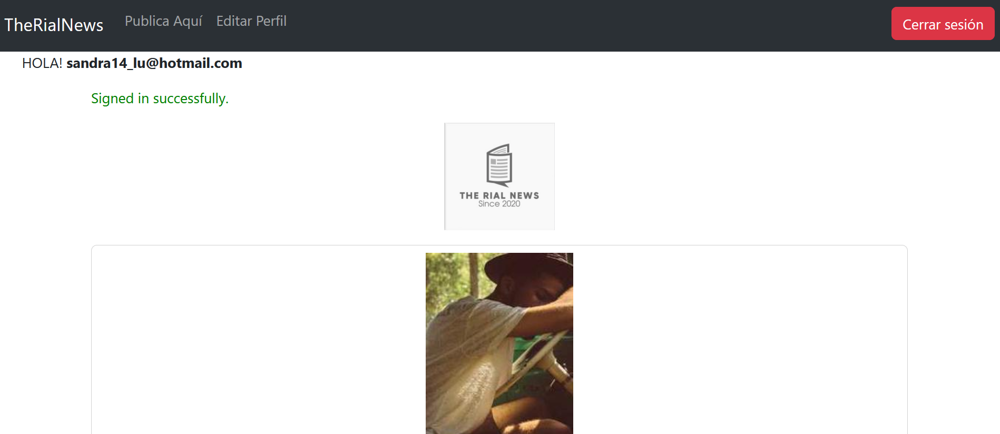
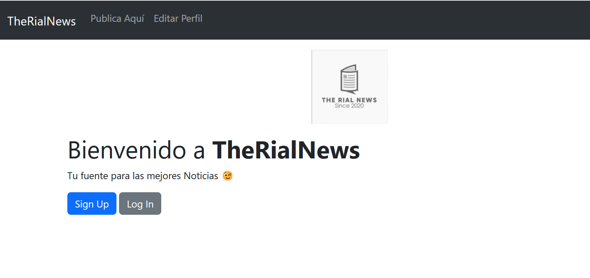

# TheRialNews

The Rial News es una aplicación web para subir Noticias, donde los usuarios pueden Iniciar sesión, y ver distintos post o escribir uno. Realizado como actividad evaluada de Bootcamp Ruby on Rails para StartUp

## Empezando 🚀

Estas instrucciones te guiarán para obtener una copia de este proyecto en funcionamiento en tu máquina local para propósitos de desarrollo y pruebas.

### Prerrequisitos 📋

Lista de software y herramientas, incluyendo versiones, que necesitas para instalar y ejecutar este proyecto:

- Sistema Operativo (Ubuntu 20.04, Windows 10 en adelante)
- Lenguaje de programación Ruby 3.2.2
- Framework Rails 7.0.6
- Base de datos PostgreSQL

### Instalación 🔧

# 1. Clona el repositorio desde GitHub
git clone https://github.com/Sandyluuu/News

# 2. Accede al directorio del proyecto
cd News 

# 3. Instala las gemas y dependencias
bundle install

# 4. Crea la base de datos y ejecuta las migraciones
rails db:create
rails db:migrate

# 5. Ejecuta el servidor de desarrollo
rails server

# Ejecutando las Pruebas ⚙️

Para ejecutar el conjunto de pruebas, utiliza el siguiente comando:
bash: rspec

# Pruebas de Estilo de Código ⌨️

Las pruebas de estilo de código garantizan que el código se ajuste a las guías de estilo y buenas prácticas establecidas.

bash: rubocop

## Uso

- Abre tu navegador y ve a la dirección `http://localhost:3000`.
- Serás dirigido a la Página Home, donde puedes registrarte o iniciar sesión
- Después de iniciar sesión, puedes revisar los distintos artículos o noticias.

# Despliegue 📦

Para desplegar el proyecto en un ambiente de producción, sigue los siguientes pasos:

    Configura el servidor de producción y asegúrate de que cumpla con los prerrequisitos.
    Configura las variables de entorno necesarias para el entorno de producción.
    Realiza un despliegue del código y asegúrate de que los assets se precompilen.
    Configura el servidor web para que sirva la aplicación.

# Construido Con 🛠️

Este proyecto fue construido utilizando las siguientes tecnologías:

    Ruby - Lenguaje de programación
    Ruby on Rails - Framework web
    Gemas utilizadas: Devise, Faker y Figaro
    Base de Datos PostgreSQL

# Contribuyendo 🖇️

Las contribuciones son bienvenidas y apreciadas. Si deseas contribuir con este proyecto, por favor sigue las instrucciones para contribuir.
Wiki 📖

Puedes encontrar más información y guías sobre cómo usar este proyecto en la Wiki.
Soporte

Si tienes algún problema o sugerencia, por favor abre un issue.
Roadmap

Puedes encontrar el plan de desarrollo y las futuras actualizaciones para este proyecto en la página de Roadmap.

# Versionado 📌

Este proyecto utiliza Git para el versionado. Puedes encontrar las versiones disponibles en las etiquetas de este repositorio.
Autores ✒️

    Nombre del autor - Trabajo inicial - Sandra Campos Galeas.

# Expresiones de Gratitud 🎁

Agradecimientos especiales a las personas y proyectos que han contribuido a este proyecto. ¡Tu apoyo es invaluable!

    Comparte este proyecto con otros 📢
    Invítanos un café ☕
    Inicia un nuevo issue o contribuye con un pull request 🔧
    Muestra tu agradecimiento diciendo gracias en un nuevo issue 😊

¡Gracias por usar The RialNews! Esperamos que sea de tu agrado 🚀